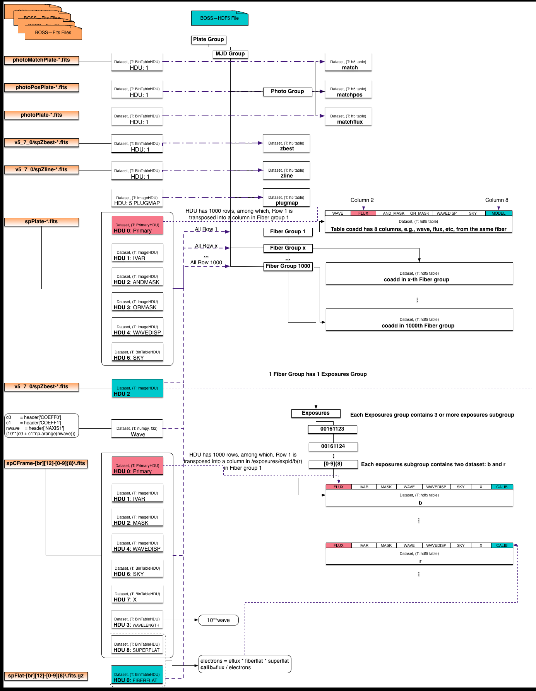

.. _fits2hdf:

Convertion
==========
This section shows the mapping between Fits and HDF5 formats, and following with the design of two H5Boss :ref:`Formats, <h5bossfmts>`

* The :ref:`mappingdiag` helps to visualize the mapping between Fits and HDF5. 
* The :ref:`mappingtab` contains more detailed information of the relationship between the Boss-Fits structure and the Boss-HDF5 hierarchy. 
* The :ref:`examplecode` helps to understand 'what is the difference in reading a'Flux' dataset in the two formats', etc. 

.. _mappingdiag:

Mapping Diagram
===============

.. _mappingtab:

Mapping Table
=============

The conversion :ref:`code, <convert>` took all files in a PLATE folder and convert into a single HDF5 file. Note that the BOSS data on NERSC project file system is organized as:

__ highlight:: c

**Fits Folder Top Level**::

 user@edison12: pwd
 /global/projecta/projectdirs/sdss/data/sdss/dr12/boss/spectro/redux/v5_7_0
 user@edison12: ls
 3520  4032  4458  4848  5338  5897  6375  6758
 3523  4033  4459  4849  5339  5898  6376  6759
 3536  4034  4460  4850  5340  5899  6377  6760
 3537  4035  4461  4851  5341  5900  6378  6780
 3538  4036  4462  4852  5342  5901  6379  6781
 3540  4037  4463  4853  5343  5902  6380  6782
 3548  4038  4464  4854  5344  5903  6381  6783
 ...
 ...

Then inside one folder, which is named afte the **PLATE** number, e.g., plate 4857:

**Fits Folder Second Level**::
 
 4857/
	photoMatchPlate-4857-55711.fits  spFluxcalib-r2-00131416.fits.gz
	photoPlate-4857-55711.fits       spFluxcalib-r2-00131417.fits.gz
	photoPosPlate-4857-55711.fits    spFluxcalib-r2-00131418.fits.gz
	redux-4857-55711                 spFluxcalib-r2-00131419.fits.gz
	redux-4857-55711.o22925          spFluxcorr-b1-00131415.fits.gz
        ...				 ...
	spCFrame-b1-00131415.fits        spFluxcorr-b2-00131415.fits.gz
	spCFrame-b1-00131416.fits        spFluxcorr-b2-00131416.fits.gz
	spCFrame-r2-00131415.fits        spFluxdistort-4857-55711.fits
	spCFrame-r2-00131416.fits        spFluxdistort-4857-55711.ps
	spCFrame-r2-00131417.fits        spFrame-b1-00131415.fits.gz
	spCFrame-r2-00131418.fits        spFrame-b1-00131416.fits.gz
	spFluxcalib-b2-00131417.fits.gz  spFrame-r2-00131418.fits.gz
	spFluxcalib-b2-00131418.fits.gz  spFrame-r2-00131419.fits.gz
	spFluxcalib-r1-00131416.fits.gz  spPlate-4857-55711.fits
	spFluxcalib-r1-00131417.fits.gz  spSN2d-4857-55711.ps
	spFluxcalib-r1-00131418.fits.gz  spSN2d-4857-55711.ps.orig
	spFluxcalib-r1-00131419.fits.gz  spectro_redux_v5_7_0_4857.sha1sum
	spFluxcalib-r2-00131415.fits.gz  v5_7_0

After the conversion, the whole folder 4857 becomes a **single** HDF5 file, in which, there are 1000 fiber groups and a few catalog datasets. 

**HDF5 Folder Top Level**::

 user@edison12: pwd
 $SCRATCH/h5boss/v5_7_0
 user@edison12: ls
 3520.h5  4032.h5  4458.h5  4848.h5  5338.h5  5897.h5  6375.h5  6758.h5
 3523.h5  4033.h5  4459.h5  4849.h5  5339.h5  5898.h5  6376.h5  6759.h5
 3536.h5  4034.h5  4460.h5  4850.h5  5340.h5  5899.h5  6377.h5  6760.h5
 3537.h5  4035.h5  4461.h5  4851.h5  5341.h5  5900.h5  6378.h5  6780.h5
 3538.h5  4036.h5  4462.h5  4852.h5  5342.h5  5901.h5  6379.h5  6781.h5
 3540.h5  4037.h5  4463.h5  4853.h5  5343.h5  5902.h5  6380.h5  6782.h5
 3548.h5  4038.h5  4464.h5  4854.h5  5344.h5  5903.h5  6381.h5  6783.h5
 ...
 ...
For the catalog, the conversion simply reads one HDU in a fits file and writes into a table dataset in HDF5. For example, as shown in the following catalog mapping table, the HDU1 in 'photoMatchPlate-pppp-mmmmm.fits' becomes a HDF5 dataset within the 'photo' group, where the higher level groups are 'plate' and 'mjd'. 

Catalog:

===============================    ========  ===============  ============
Fits File                          Fits HDU  HDF5 Group       HDF5 Dataset
===============================    ========  ===============  ============
photoMatchPlate-pppp-mmmmm.fits    HDU 1     plate/mjd/photo  match
photoPosPlate-pppp-mmmmm.fits 	   HDU 1     plate/mjd/photo  matchpos
photoPlate-pppp-mmmmm.fits         HDU 1     plate/mjd/photo  matchflux
v5_7_0/spZbest-pppp-mmmmm.fits     HDU 1     plate/mjd        zbest
v5_7_0/spZline-pppp-mmmmm.fits     HDU 1     plate/mjd        zline
spPlate-pppp-mmmmm.fits            HDU 5     plate/mjd        plugmap
===============================    ========  ===============  ============

In each of the 1000 fiber groups, the fiber number is used as the group name in HDF5, e.g., 1, which is under 'plate/mjd'. In a fiber group, there is a 'coadd' dataset, which is a 4000*8 2D array,(the number 4000 varies in different plates). The number 8 refers to the total number of wavelengths that're converted, i.e., **Flux, Ivar, and_mask, or_mask, wavedisp, wave, sky and model**. These wavelengths are from different HDUs of the 'spPlate-pppp-mmmmm.fits' file. For example, the 'Flux' is from the Primary HDU. In fits, this primary HDU is a 1000 by 4000 2D table, in HDF5 file, this 2D table is split into 1000 fiber groups, where each fiber group only has the wavelength of one fiber. Similar convertion was conducted on the 'Exposures', which is from 'spCFrame-[br][12]-[0-9]{8}.fits' file. Special attention needs to be paid on the column 'wave' in coadd, and columns 'wave' and 'clib' in the b/r dataset, as noted below the table.  

Spectra:

== ================================ ================ ===================================== ==================================
Id Fits File                        Fits HDU         HDF5 Group       			   HDF5 Dataset(ColumnID) ColumnName
== ================================ ================ ===================================== ==================================
1  spPlate-pppp-mmmmm.fits          HDU 0            plate/mjd/[1-1000]			   coadd(col2)	FLUX 
2  spPlate-pppp-mmmmm.fits          HDU 1 IVAR       plate/mjd/[1-1000]			   coadd(col3)	IVAR
3  spPlate-pppp-mmmmm.fits          HDU 2 ANDMASK    plate/mjd/[1-1000]   		   coadd(col4)	AND_MASK
4  spPlate-pppp-mmmmm.fits          HDU 3 ORMASK     plate/mjd/[1-1000]   		   coadd(col5)	OR_MASK    
5  spPlate-pppp-mmmmm.fits          HDU 4 WAVEDISP   plate/mjd/[1-1000]   		   coadd(col6)	WAVEDISP
6  spPlate-pppp-mmmmm.fits          HDU 5 PLUGMAP    plate/mjd/[1-1000]                    coadd(col1)*	WAVE
7  spPlate-pppp-mmmmm.fits          HDU 6 SKY        plate/mjd/[1-1000]   		   coadd(col7)	SKY
8                                                    plate/mjd/[1-1000]                    coadd(col8)	MODEL
9  spCFrame-[br][12]-[0-9]{8}.fits  HDU 0            plate/mjd/[1-1000]/exposures/[0-9]{8} b/r(col1)	FLUX
10 spCFrame-[br][12]-[0-9]{8}.fits  HDU 1 IVAR       plate/mjd/[1-1000]/exposures/[0-9]{8} b/r(col2)	IVAR
11 spCFrame-[br][12]-[0-9]{8}.fits  HDU 2 MASK       plate/mjd/[1-1000]/exposures/[0-9]{8} b/r(col3)	MASK
12 spCFrame-[br][12]-[0-9]{8}.fits  HDU 3 WAVELENGTH plate/mjd/[1-1000]/exposures/[0-9]{8} b/r(col4)*	WAVE
13 spCFrame-[br][12]-[0-9]{8}.fits  HDU 4 WAVEDISP   plate/mjd/[1-1000]/exposures/[0-9]{8} b/r(col5)	WAVEDISP
14 spCFrame-[br][12]-[0-9]{8}.fits  HDU 6 SKY        plate/mjd/[1-1000]/exposures/[0-9]{8} b/r(col6)	SKY
15 spCFrame-[br][12]-[0-9]{8}.fits  HDU 7 X          plate/mjd/[1-1000]/exposures/[0-9]{8} b/r(col7)	X
16 spCFrame-[br][12]-[0-9]{8}.fits  HDU 8 SUPERFLAT  plate/mjd/[1-1000]/exposures/[0-9]{8} b/r(col8)*	CLIB
17 spFlat-[br][12]-[0-9]{8}.fits.gz HDU 0 FIBERFLAT  plate/mjd/[1-1000]/exposures/[0-9]{8} b/r(col8)*	CLIB
== ================================ ================ ===================================== ==================================

Notes: The convertion simply copy the data in fits file and reorginze in HDF5 file, a few exceptions where the data need additional calculation can be better understood by reading the code. Here are just brief descriptions:

.. highlight:: c

line 8, This `wave` column is obtained with the following python code::

 header = fits.open(platefile)[0].header
 c0 = header['COEFF0']
 c1 = header['COEFF1']
 nwave = header['NAXIS1']
 wave     = (10**(c0 + c1*np.arange(nwave)))
  
line 12, wavelength is log based, so the conversion code calculates the reverse, i.e., 'WAVE'=10^wavelength 

line 16 and 17, the 'CLIB' is calculated with the following python code::

 electrons = eflux * fiberflat * superflat
 calib = flux / electrons 
 
.. highlight:: c

.. _examplecode:

Example Codes 
=============

The sample codes for reading same data from Fits versus from the converted HDF5 file:

**Read plate: 4857, mjd: 55711, fiber: 4, FLUX**

Read Flux from Fits::

     dfits = fitsio.FITS('spPlate-4857-55711.fits')
     dflux = dfits[0][3:4,:]
 
Read Flux from HDF5::

     dh5   = h5py.File('4857-55711.h5')
     dflux = dh5['4857/55711/4/coadd']['FLUX']

Read Multiple HDUs from Fits::

     dfits = fitsio.FITS('spPlate-4857-55711.fits')
     dflux = dfits[0][3:4,:]
     dwave = dfits[1][3:4,:]

Read Multiple HDUs from HDF5::

     dh5   = h5py.File('4857-55711.h5')
     dflux_wave = dh5['4857/55711/4/coadd'][('FLUX','IVAR')]

Read All HDUs from Fits::

     for i in range(0,6):
      dall[i] = dfits[i][3:4,:]

Read All HDUs from HDF5::

     dall = dh5['4857/55711/4/coadd'][()]
